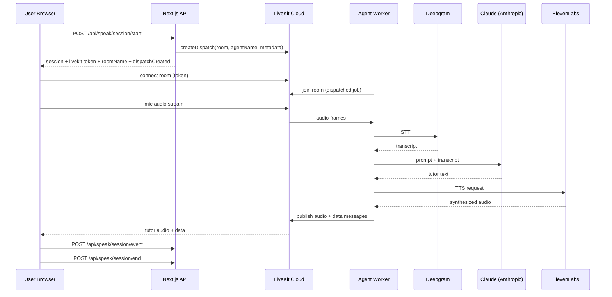

# Voice Runtime Architecture

## Purpose
This document is the source-of-truth for how Decipher voice works in production today, where failures happen, and how to debug quickly.

## Current Mode
- `VOICE_ONLY_MODE=1` is enabled in Vercel production right now.
- This allows voice flow to run without a production Postgres dependency.
- Voice/session APIs can return `skippedPersistence: true` when DB writes are bypassed.

## High-Level Flow
1. User opens `/speak` and starts a scenario.
2. `POST /api/speak/session/start`:
   - resolves session user context
   - creates/derives session id (voice-only fallback if DB unavailable)
   - mints LiveKit token
   - explicitly dispatches agent job via `AgentDispatchClient.createDispatch(...)`
3. Browser connects to LiveKit room with token.
4. Agent worker receives dispatched job and joins same room.
5. Pipeline inside worker:
   - STT: Deepgram
   - LLM: Anthropic Claude (OpenAI-compatible plugin)
   - TTS: ElevenLabs
6. Browser sends/receives audio over LiveKit.
7. Browser receives transcript-like data messages and calls:
   - `POST /api/speak/session/event`
8. Session ends via:
   - `POST /api/speak/session/end`

## Component Map
- Web app (Next.js):
  - `/src/app/speak/SpeakClient.tsx`
  - `/src/app/api/speak/session/start/route.ts`
  - `/src/app/api/speak/session/event/route.ts`
  - `/src/app/api/speak/session/end/route.ts`
- Agent worker:
  - `/src/agent/index.ts`
- Token generation:
  - `/src/lib/livekit/token.ts`

## Sequence Diagram

## Required Environment Variables

### Web App (Vercel)
- `LIVEKIT_URL`
- `LIVEKIT_API_KEY`
- `LIVEKIT_API_SECRET`
- `LIVEKIT_AGENT_NAME` (default `decipher-agent`)
- `DEEPGRAM_API_KEY` (needed by worker but currently also present in Vercel)
- `ELEVENLABS_API_KEY` (needed by worker but currently also present in Vercel)
- `ANTHROPIC_API_KEY` (needed by worker but currently also present in Vercel)
- `VOICE_ONLY_MODE=1` (current production mode)

### Agent Worker Process
- `LIVEKIT_URL`
- `LIVEKIT_API_KEY`
- `LIVEKIT_API_SECRET`
- `LIVEKIT_AGENT_NAME` (must match dispatch target)
- `DEEPGRAM_API_KEY`
- `ELEVENLABS_API_KEY`
- `ANTHROPIC_API_KEY`

## Most Common Failure Modes
1. **No audio reply, but room connects**
   - Cause: no active worker process, or dispatch/agent name mismatch.
   - Check: `/api/speak/session/start` response `livekit.dispatchCreated`.
2. **dispatchCreated=false**
   - Cause: dispatch API call failed (host/keys/permissions/agentName).
3. **Worker gets job then times out**
   - Cause: worker child runner init timeout.
   - Current mitigation: raised `initializeProcessTimeout` in worker options.
4. **Routes return 500 in voice-first deploy**
   - Cause: route still hard-depends on DB with placeholder `DATABASE_URL`.
   - Mitigation: voice-only fallbacks on critical pages/routes.

## Fast Debug Runbook
1. Start session and inspect JSON from `/api/speak/session/start`.
2. Verify:
   - `ok: true`
   - `livekit` exists
   - `dispatchCreated: true`
3. Confirm worker process is running and registered.
4. Confirm worker logs show:
   - received job request
   - job started
   - no init timeout
5. In browser:
   - mic permission granted
   - room connected
   - speak first utterance
6. If still silent:
   - check worker logs for provider auth failures (Deepgram/Claude/ElevenLabs)
   - check LiveKit room participants to confirm both learner + agent present

## Recommended Next Step
- Move worker to always-on hosted runtime (not local machine) and point production at that stable worker pool.
- Then disable `VOICE_ONLY_MODE` and restore full DB-backed session persistence.
